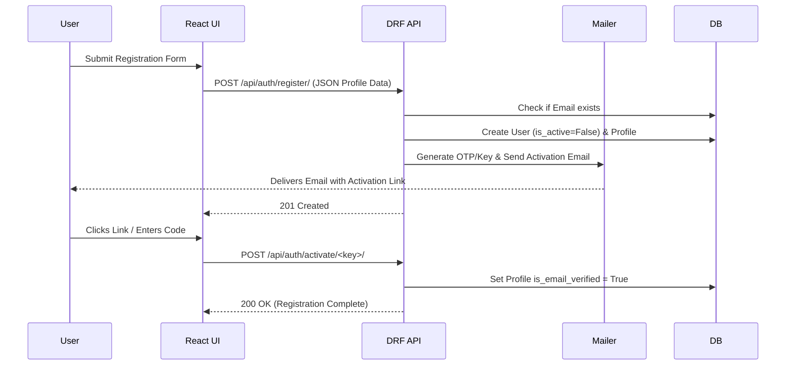
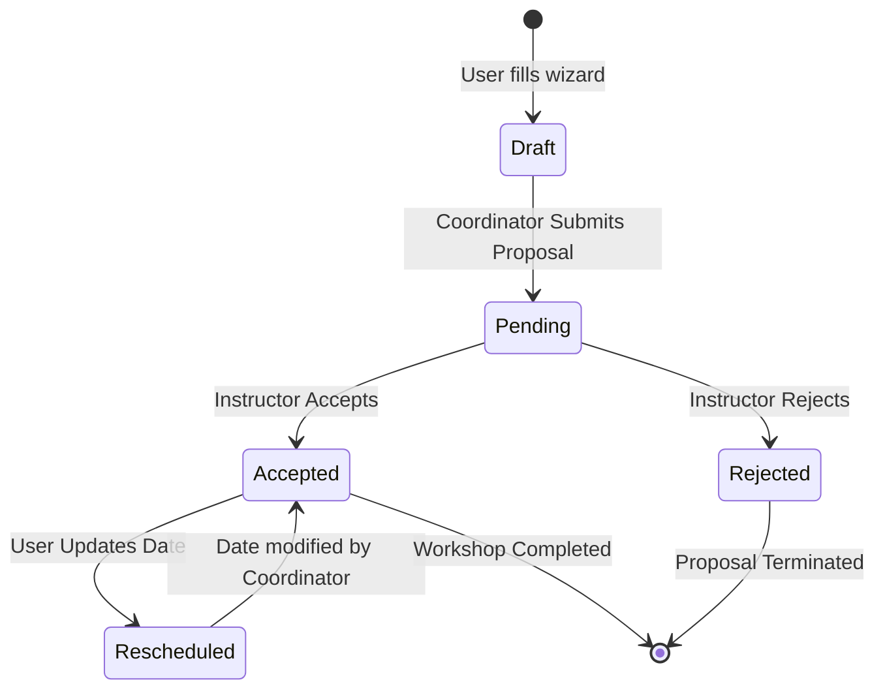

# Data Flow & Architecture Documentation

This document outlines the end-to-end data processing pipelines, backend-frontend orchestration, API integrations, and the core workflows of the FOSSEE Workshop Booking Portal.

---

## 1. Backend & Frontend Orchestration

The platform shifted from a monolithic server-side rendering application to a decoupled architecture:
- **Frontend**: React Single-Page Application (SPA) running on Vite (`localhost:5173` or Netlify).
- **Backend**: Django REST Framework API running on Gunicorn/Render (`localhost:8000` or Render).

### How They Communicate:
Because they are decoupled, data is orchestrated securely using **RESTful JSON payloads**, **CORS**, and **Session + CSRF Cookies**. 

#### The Lifecycle of an API Request
1. **Action**: The User clicks a button in the React UI (e.g., "Accept Workshop").
2. **Axios Interceptor**: Before the request leaves the frontend, an Axios interceptor extracts the `csrftoken` from the browser cookies and explicitly appends it to the HTTP Headers as `X-CSRFToken`. 
3. **Session Binding**: Axios is configured with `withCredentials: true`, ensuring the `sessionid` and `csrftoken` are sent along with the request payload.
4. **CORS Middleware**: Django receives the request and the `corsheaders` middleware verifies if the origin (e.g., `http://localhost:5173`) is trusted.
5. **CSRF Middleware**: Django validates that the `X-CSRFToken` header exactly matches the payload in the `csrftoken` cookie.
6. **Authentication**: Django resolves the `sessionid` against its session store to fetch the logged-in `User` and `Profile` models.
7. **Execution**: The DRF View executes business logic (Database I/O) and responds with JSON.
8. **Frontend State**: The React app updates its Component state, fires a Toast notification, and re-renders the UI without refreshing the page.

---

## 2. Data Processing Pipelines & Workflow

### User Registration Pipeline


### Workshop Lifecycle Pipeline
The fundamental data object of this application is the `Workshop` model. It transitions through a strict state machine data flow:



---

## 3. Comprehensive API Links & Schemas

The orchestration relies heavily on specific REST channels. Assuming the base URL is `http://localhost:8000/api`:

### 3.1 Authentication Data
| Endpoint | Method | Payload Data | Purpose |
|----------|--------|--------------|---------|
| `/auth/login/` | `POST` | `{"username": "email@test.com", "password": "xxx"}` | Validates user, returns 200 and issues `sessionid`. |
| `/auth/logout/` | `POST` | Empty | Destroys the server-side session. |
| `/auth/me/` | `GET` | Empty | Returns `{ "user_id": 1, "role": "coordinator" }` |
| `/auth/activate/<key>` | `POST` | Empty | Modifies database schema to set email verified to `True`. |

### 3.2 Workshop Data
| Endpoint | Method | Payload Data | Purpose |
|----------|--------|--------------|---------|
| `/workshops/` | `GET` | N/A | Fetches `[WorkshopSerializer]` list based on logged-in user. |
| `/workshops/` | `POST` | `{"type_id": 2, "date": "10-10-2026", "time": "14:00"}` | Database insertion of a new Workshop via Coordinator. |
| `/workshops/<id>/accept/` | `POST` | N/A | Mutates `status_id` from Pending to Accepted. Logs event. |
| `/workshops/<id>/reject/` | `POST` | N/A | Mutates `status_id` from Pending to Rejected. |
| `/workshops/<id>/date/` | `PUT` | `{"new_date": "12-10-2026"}` | Reschedules a workshop. |

### 3.3 Dashboard & Chart Data (Statistics)
| Endpoint | Method | Result Data Shape | Purpose |
|----------|--------|-------------------|---------|
| `/stats/public/` | `GET` | `{"states": [{"state": "MH", "count": 10}], "types": [...]}` | Consumed by Recharts in React to render bar/pie UI. |
| `/stats/user/` | `GET` | `{"monthly": {"Jan": 2, "Feb": 5}, "success_rate": 80}` | Consumed in the top cards on Coordinator / Instructor dash. |

---

## 4. Web Charts Integration

Data visualization is processed entirely on the client side using **Recharts**.
1. The Frontend queries `/api/stats/public/`.
2. The Backend uses **Pandas** to aggregate data from SQLite/PostgreSQL (grouping by state, grouping by workshop type).
3. The Backend returns lightweight JSON payload.
4. The React context state hooks map this array JSON into `<BarChart>` and `<PieChart>` components seamlessly sizing to the user's viewport using `<ResponsiveContainer>`.

---

## 5. Sample Walkthrough (End-To-End Journey)

Let's trace a piece of data dynamically through the whole stack:

**Scenario: A Coordinator Proposes a Python Workshop.**
1. **Frontend Input**: The coordinator selects "Python Basics" and a date in the React Wizard. They hit "Submit".
2. **Data Marshaling**: The React component creates a JSON context:
   ```json
   {
       "workshop_type": 5, 
       "date": "2026-05-12T10:00:00Z"
   }
   ```
3. **Transport**: Axios makes the `POST` request. Interceptor attaches `X-CSRFToken` security header.
4. **Django Receipt (Backend)**: DRF receives the payload. DRF Serializer evaluates if `workshop_type=5` exists in the database. Validation passes.
5. **Database Commit**: DRF creates a row in the `workshop_app_workshop` SQLite table. Status auto-defaults to `1` (Pending).
6. **Background Task (Async)**: Django queues an email to be sent via SendGrid SMTP to notify the relevant Instructor.
7. **Callback Success**: `201 Created` string returned to React.
8. **Frontend Reaction**: The React UI immediately fires `toast.success("Workshop Proposed!")`. The Dashboard's `useEffect` hook auto-refetches the `/api/workshops/` list.
9. **UI Transformation**: The new Workshop instantly appears on screen wrapped in a Yellow Pending Badge, completing the real-time feedback loop.
