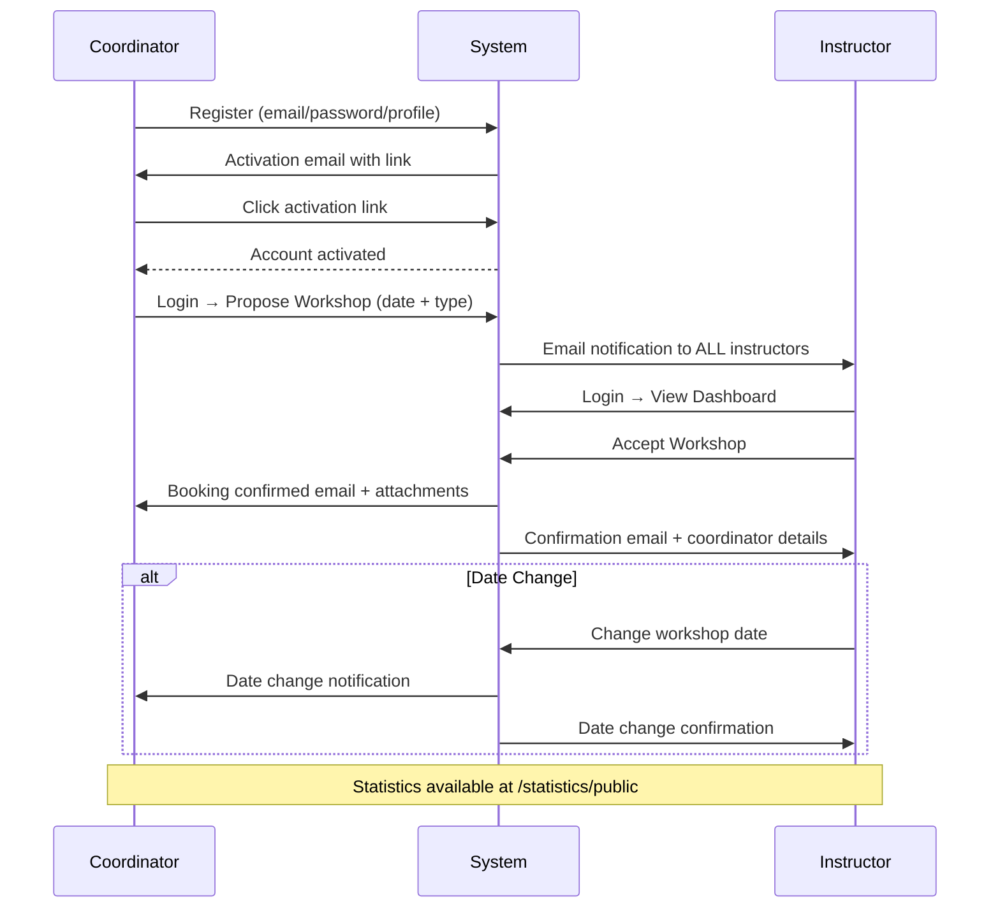

# Workshop Booking — Full Repository Analysis

> **Project**: FOSSEE Workshop Booking Portal (IIT Bombay)
> **Framework**: Django 3.0.7 · Python 3.5+
> **Database**: SQLite3 (default) / configurable via `.env`

---

## 1. High-Level Directory Tree

```
workshop_booking-master/
├── manage.py                  # Django management entry point
├── requirements.txt           # pip dependencies
├── local_settings.py          # Email credentials (gitignored values)
├── .sampleenv                 # Template for DB env vars
├── .travis.yml                # CI: makemigrations → migrate → coverage run
├── .coveragerc                # Coverage config (omits tests/migrations)
├── LICENSE                    # GPL
├── README.md                  # Feature overview
│
├── workshop_portal/           # ★ Django project config
│   ├── __init__.py
│   ├── settings.py
│   ├── urls.py
│   ├── views.py
│   └── wsgi.py
│
├── workshop_app/              # ★ Core app — workshops, users, email
│   ├── __init__.py
│   ├── apps.py
│   ├── models.py
│   ├── views.py
│   ├── forms.py
│   ├── admin.py
│   ├── urls.py
│   ├── urls_password_reset.py
│   ├── send_mails.py
│   ├── reminder_script.py
│   ├── reminder_script.sh
│   ├── templatetags/
│   │   ├── __init__.py
│   │   └── custom_filters.py
│   ├── templates/
│   │   ├── workshop_app/      (15 HTML templates)
│   │   └── registration/      (6 password-reset templates)
│   ├── static/
│   │   ├── workshop_app/      (CSS, JS, images)
│   │   └── cms/               (CMS static uploads)
│   ├── data/                  (MEDIA_ROOT — uploaded attachments)
│   ├── logs/                  (email log config)
│   ├── migrations/            (15 migration files)
│   └── tests/
│       ├── __init__.py
│       ├── test_models.py     (9.5 KB)
│       └── test_views.py      (11.1 KB)
│
├── statistics_app/            # ★ Workshop statistics & charts
│   ├── __init__.py
│   ├── apps.py
│   ├── admin.py
│   ├── models.py              (empty — uses workshop_app models)
│   ├── views.py
│   ├── forms.py
│   ├── urls.py
│   ├── templates/
│   │   └── statistics_app/    (5 HTML templates)
│   └── tests/
│       ├── __init__.py
│       └── test_views.py      (6.0 KB)
│
├── teams/                     # ★ Instructor team grouping
│   ├── __init__.py
│   ├── apps.py
│   ├── admin.py
│   ├── models.py
│   ├── views.py               (empty)
│   └── tests.py               (empty)
│
├── cms/                       # ★ Simple CMS for static pages
│   ├── __init__.py
│   ├── apps.py
│   ├── admin.py
│   ├── models.py
│   ├── views.py
│   ├── urls.py
│   ├── templates/
│   │   └── cms_base.html
│   └── tests.py               (empty)
│
└── docs/
    ├── Getting_Started.md     # Setup guide
    └── ModelsTable_Diagram.jpg
```

---

## 2. Data Model (ER Diagram)

```mermaid
erDiagram
    User ||--o| Profile : "has one"
    User ||--o{ Workshop : "coordinates"
    User ||--o{ Workshop : "instructs"
    User ||--o{ Comment : "authors"
    User ||--o| Team : "creates"
    
    Profile }o--o{ Team : "members"
    
    WorkshopType ||--o{ Workshop : "has type"
    WorkshopType ||--o{ AttachmentFile : "has files"
    
    Workshop ||--o{ Comment : "has comments"
    
    Profile {
        int id PK
        FK user_id
        string title
        string institute
        string department
        string phone_number
        string position
        string location
        string state
        bool is_email_verified
        string activation_key
        datetime key_expiry_time
    }
    
    WorkshopType {
        int id PK
        string name
        text description
        int duration
        text terms_and_conditions
    }
    
    Workshop {
        int id PK
        uuid uid
        FK coordinator_id
        FK instructor_id
        FK workshop_type_id
        date date
        int status
        bool tnc_accepted
    }
    
    Comment {
        int id PK
        FK author_id
        FK workshop_id
        text comment
        bool public
        datetime created_date
    }
    
    Testimonial {
        int id PK
        string name
        string institute
        string department
        text message
    }
    
    Banner {
        int id PK
        string title
        text html
        bool active
    }
    
    Team {
        int id PK
        FK creator_id
        datetime created_date
    }
    
    Nav {
        int id PK
        string name
        string link
        int position
        bool active
    }
    
    SubNav {
        int id PK
        FK nav_id
        string name
        string link
        int position
        bool active
    }
    
    Page {
        int id PK
        string permalink
        string title
        text imports
        text content
        datetime pub_date
        bool active
    }
    
    StaticFile {
        int id PK
        string filename
        file file
    }
```

---

## 3. URL Routing Map

| Prefix | Target | App |
|--------|--------|-----|
| `/` | `workshop_portal.views.index` → redirects to CMS home or workshop index | project |
| `/admin/` | Django Admin | built-in |
| `/workshop/` | `workshop_app.urls` | workshop_app |
| `/reset/` | `django.contrib.auth.urls` | built-in |
| `/page/` | `cms.urls` | cms |
| `/statistics/` | `statistics_app.urls` | statistics_app |

### `workshop_app` URL Endpoints

| URL Pattern | View Function | Purpose |
|-------------|--------------|---------|
| `/workshop/` | `index` | Redirect: login → dashboard |
| `/workshop/register/` | `user_register` | User registration form |
| `/workshop/activate_user/<key>` | `activate_user` | Email verification |
| `/workshop/login/` | `user_login` | Login form |
| `/workshop/logout/` | `user_logout` | Logout |
| `/workshop/status` | `workshop_status_coordinator` | Coordinator's workshop list |
| `/workshop/dashboard` | `workshop_status_instructor` | Instructor's workshop dashboard |
| `/workshop/accept_workshop/<id>` | `accept_workshop` | Accept a proposed workshop |
| `/workshop/change_workshop_date/<id>` | `change_workshop_date` | Reschedule workshop |
| `/workshop/propose/` | `propose_workshop` | Coordinator proposes a workshop |
| `/workshop/details/<id>` | `workshop_details` | Workshop detail + comments |
| `/workshop/type_details/<id>` | `workshop_type_details` | View/edit workshop type |
| `/workshop/type_tnc/<id>` | `workshop_type_tnc` | AJAX: get terms & conditions JSON |
| `/workshop/types/` | `workshop_type_list` | Paginated list of workshop types |
| `/workshop/add_workshop_type` | `add_workshop_type` | Instructor adds new workshop type |
| `/workshop/delete_attachment_file/<id>` | `delete_attachment_file` | Delete an uploaded file |
| `/workshop/view_profile/` | `view_own_profile` | View/edit own profile |
| `/workshop/view_profile/<user_id>` | `view_profile` | Instructor views coordinator profile |

### `statistics_app` URL Endpoints

| URL Pattern | View | Purpose |
|-------------|------|---------|
| `/statistics/public` | `workshop_public_stats` | Public stats with filters, charts, CSV download |
| `/statistics/team` | `team_stats` | Team workshop count (bar chart) |
| `/statistics/team/<id>` | `team_stats` | Specific team stats |

### `cms` URL Endpoints

| URL Pattern | View | Purpose |
|-------------|------|---------|
| `/page/` | `home` | Default CMS page |
| `/page/<permalink>` | `home` | Specific CMS page by permalink |

---

## 4. File-by-File Function Analysis

---

### 4.1. `workshop_portal/` — Project Configuration

#### [settings.py](file:///d:/Projects/IIT%20B/workshop_booking-master/workshop_booking-master/workshop_portal/settings.py)

Core Django settings. Key configurations:
- **Apps**: `workshop_app`, `statistics_app`, `teams`, `cms`
- **Database**: Configurable via `python-decouple` env vars; defaults to SQLite3
- **Email**: Imports credentials from `local_settings.py`; uses console backend in dev
- **Time zone**: `Asia/Kolkata`
- **Session**: Expires at browser close, 1-hour cookie age
- **Media**: Uploads to `workshop_app/data/`
- **Logging**: Email logs stored in `workshop_app/logs/`

#### [urls.py](file:///d:/Projects/IIT%20B/workshop_booking-master/workshop_booking-master/workshop_portal/urls.py)

Root URL dispatcher. Routes to admin, workshop_app, auth password reset, cms, statistics_app. Also serves media files in development.

#### [views.py](file:///d:/Projects/IIT%20B/workshop_booking-master/workshop_booking-master/workshop_portal/views.py)

- **`index(request)`**: Root landing page. Checks if a CMS home page exists (matching `HOME_PAGE_TITLE`); if so redirects to CMS, otherwise redirects to `workshop_app:index`.

#### [wsgi.py](file:///d:/Projects/IIT%20B/workshop_booking-master/workshop_booking-master/workshop_portal/wsgi.py)

Standard WSGI application entry point for deployment.

---

### 4.2. `workshop_app/` — Core Application

#### [models.py](file:///d:/Projects/IIT%20B/workshop_booking-master/workshop_booking-master/workshop_app/models.py) — 263 lines

**Constants / Choices:**
- `position_choices` — `coordinator` / `instructor`
- `department_choices` — 10 engineering departments
- `title` — honorifics (Prof., Dr., Mr., Mrs., etc.)
- `source` — how users heard about the platform
- `states` — all 29 Indian states + 7 UTs with ISO codes

**Helper Functions:**
- `has_profile(user)` — checks if a user has an associated Profile
- `attachments(instance, filename)` — generates upload path based on workshop type name

**Models:**

| Model | Purpose | Key Fields |
|-------|---------|------------|
| `Profile` | Extended user profile (1:1 with User) | title, institute, department, phone_number, position, state, location, is_email_verified, activation_key, key_expiry_time |
| `WorkshopType` | Admin-defined workshop categories | name, description, duration (days), terms_and_conditions |
| `AttachmentFile` | Files uploaded for a workshop type | attachments (FileField), workshop_type (FK) |
| `Workshop` | A booked/proposed workshop instance | uid (UUID), coordinator (FK User), instructor (FK User), workshop_type (FK), date, status (0=Pending, 1=Accepted, 2=Deleted), tnc_accepted |
| `Testimonial` | User testimonials | name, institute, department, message |
| `Comment` | Comments on workshops | author (FK User), comment, public (bool), created_date, workshop (FK) |
| `Banner` | Homepage banner HTML | title, html, active |

**Custom Manager — `WorkshopManager`:**
- `get_workshops_by_state(workshops)` — Aggregates workshops by coordinator's state using pandas
- `get_workshops_by_type(workshops)` — Aggregates workshops by type using pandas

---

#### [views.py](file:///d:/Projects/IIT%20B/workshop_booking-master/workshop_booking-master/workshop_app/views.py) — 503 lines

**Helper Functions:**
| Function | Purpose |
|----------|---------|
| `is_email_checked(user)` | Returns `user.profile.is_email_verified` |
| `is_instructor(user)` | Checks if user belongs to `instructor` group |
| `get_landing_page(user)` | Returns the appropriate dashboard URL based on role |

**View Functions:**

| Function | Auth | Purpose |
|----------|------|---------|
| `index(request)` | No | Redirects authenticated users to dashboard, others to login |
| `user_login(request)` | No | GET: render login form; POST: authenticate, verify email, redirect |
| `user_logout(request)` | No | Logs out and renders logout page |
| `activate_user(request, key)` | No | Email activation: validates key, marks `is_email_verified=True`. Deletes expired profiles. |
| `user_register(request)` | No | GET: render registration form; POST: creates User + Profile, sends activation email |
| `workshop_status_coordinator(request)` | ✓ | Lists workshops proposed by the logged-in coordinator |
| `workshop_status_instructor(request)` | ✓ | Lists pending + upcoming workshops for the instructor |
| `accept_workshop(request, workshop_id)` | ✓ Instructor | Sets workshop status=1, assigns instructor, sends confirmation emails to both parties |
| `change_workshop_date(request, workshop_id)` | ✓ Instructor | POST: updates workshop date, sends date-change emails |
| `propose_workshop(request)` | ✓ Coordinator | GET: render form; POST: creates Workshop, emails all instructors |
| `workshop_type_details(request, workshop_type_id)` | ✓ | Instructor: edit type + manage attachments; Coordinator: view details |
| `delete_attachment_file(request, file_id)` | ✓ Instructor | Deletes attachment file from disk + DB |
| `workshop_type_tnc(request, workshop_type_id)` | ✓ | Returns JSON `{tnc: "..."}` for AJAX T&C display |
| `workshop_type_list(request)` | No | Paginated list of all workshop types (12 per page) |
| `workshop_details(request, workshop_id)` | ✓ | Workshop detail page + comment posting; instructors see all comments, coordinators see public only |
| `add_workshop_type(request)` | ✓ Instructor | Form to create new WorkshopType |
| `view_profile(request, user_id)` | ✓ Instructor | Instructor views a coordinator's profile + their workshops |
| `view_own_profile(request)` | ✓ | View/edit own profile (first_name, last_name, all profile fields) |

---

#### [forms.py](file:///d:/Projects/IIT%20B/workshop_booking-master/workshop_booking-master/workshop_app/forms.py) — 248 lines

| Form Class | Type | Purpose | Key Logic |
|------------|------|---------|-----------|
| `UserRegistrationForm` | `forms.Form` | New user registration | Validates username uniqueness, password match, email uniqueness. `save()` creates User + Profile + activation key. |
| `UserLoginForm` | `forms.Form` | Login | `clean()` authenticates credentials, returns User object |
| `WorkshopForm` | `ModelForm(Workshop)` | Propose a workshop | Excludes status/instructor/coordinator; date widget uses datepicker |
| `CommentsForm` | `ModelForm(Comment)` | Post comments | Excludes author/created_date/workshop |
| `WorkshopTypeForm` | `ModelForm(WorkshopType)` | Add/edit workshop type | Applies `form-control` class to all fields |
| `AttachmentFileForm` | `ModelForm(AttachmentFile)` | Upload attachments | Excludes workshop_type FK |
| `ProfileForm` | `ModelForm(Profile)` | Edit profile | Adds first_name/last_name from User; excludes email verification fields |

---

#### [admin.py](file:///d:/Projects/IIT%20B/workshop_booking-master/workshop_booking-master/workshop_app/admin.py) — 128 lines

| Admin Class | Model | Features |
|-------------|-------|----------|
| `ProfileAdmin` | Profile | List display: title/user/institute/location/department/phone/position; CSV download action |
| `WorkshopAdmin` | Workshop | List: type/instructor/date/status/coordinator; filter by type/date; CSV download |
| `WorkshopTypeAdmin` | WorkshopType | List: name/duration; inline `AttachmentFile`; CSV download |
| `TestimonialAdmin` | Testimonial | List: name/department/institute; CSV download |
| `CommentAdmin` | Comment | List: workshop/comment/date/author/public; filter by all |

> [!WARNING]
> `WorkshopTypeAdmin.download_csv` and `TestimonialAdmin.download_csv` reference `csv.writer` but **never import `csv`** — these actions will raise `NameError` at runtime.

---

#### [send_mails.py](file:///d:/Projects/IIT%20B/workshop_booking-master/workshop_booking-master/workshop_app/send_mails.py) — 440 lines

**Utility Functions:**
| Function | Purpose |
|----------|---------|
| `validateEmail(email)` | Regex-based email validation (returns 0 or 1) |
| `generate_activation_key(username)` | SHA-256 hash of random string + username for email activation |
| `send_smtp_email(...)` | Low-level SMTP fallback: connects to SMTP server via TLS, sends with optional attachments |

**Main Function — `send_email(request, call_on, ...)`**

Dispatches email based on `call_on` parameter:

| `call_on` Value | Recipients | Content |
|-----------------|-----------|---------|
| `"Registration"` | Registering user | Activation link |
| `"Booking"` | Instructor + Coordinator | Booking notification with coordinator details (instructor) / pending confirmation (coordinator) |
| `"Booking Confirmed"` | Both | Confirmation + workshop attachments as email attachments |
| `"Booking Request Rejected"` | Both | Rejection notice |
| `"Workshop Deleted"` | Deleting user | Deletion confirmation |
| `"Proposed Workshop"` | All instructors | New workshop proposal details |
| `"Change Date"` | Instructor + Coordinator | Date change notification |

All emails use `django.core.mail.send_mail` with `send_smtp_email` as a fallback. Logging configured via YAML config.

---

#### [reminder_script.py](file:///d:/Projects/IIT%20B/workshop_booking-master/workshop_booking-master/workshop_app/reminder_script.py) — 119 lines

Standalone script (runs outside Django's request cycle). Sets up Django environment, then:
- Queries workshops happening in 2 days with `status='ACCEPTED'`
- Sends reminder emails to both instructor and coordinator
- References `RequestedWorkshop` and `ProposeWorkshopDate` models that **no longer exist** in the current models (likely legacy code)

#### [reminder_script.sh](file:///d:/Projects/IIT%20B/workshop_booking-master/workshop_booking-master/workshop_app/reminder_script.sh)

Shell wrapper: activates virtualenv → runs `reminder_script.py` → runs `manage.py train` (chatbot training, no longer in codebase).

---

#### [urls_password_reset.py](file:///d:/Projects/IIT%20B/workshop_booking-master/workshop_booking-master/workshop_app/urls_password_reset.py)

> [!NOTE]
> This file is **not included** in any `urlpatterns`; the project uses `django.contrib.auth.urls` at `/reset/` instead. This appears to be **dead code** from an older Django version (uses function-based auth views that were removed in Django 2.0+).

---

#### [templatetags/custom_filters.py](file:///d:/Projects/IIT%20B/workshop_booking-master/workshop_booking-master/workshop_app/templatetags/custom_filters.py)

Single template filter:
- **`has_group(user, group_name)`** — Used in templates as `` to conditionally render instructor-only UI elements.

---

#### [apps.py](file:///d:/Projects/IIT%20B/workshop_booking-master/workshop_booking-master/workshop_app/apps.py)

Standard `AppConfig` with `name = 'workshop_app'`.

---

### 4.3. `statistics_app/` — Statistics & Analytics

#### [views.py](file:///d:/Projects/IIT%20B/workshop_booking-master/workshop_booking-master/statistics_app/views.py) — 132 lines

| Function | Auth | Purpose |
|----------|------|---------|
| `is_instructor(user)` | — | Helper: checks instructor group (duplicated from workshop_app) |
| `is_email_checked(user)` | — | Helper: checks email verification |
| `workshop_public_stats(request)` | No | Public statistics page with filters (date range, state, workshop type, sort). Renders charts (workshops by state map, workshops by type pie chart). Supports CSV download via pandas. Defaults to next 15 days of accepted workshops. |
| `team_stats(request, team_id)` | ✓ | Team-level statistics: bar chart of workshop counts per team member. Verifies user is a team member. |

#### [forms.py](file:///d:/Projects/IIT%20B/workshop_booking-master/workshop_booking-master/statistics_app/forms.py) — 50 lines

- **`FilterForm`** — Date range filter with optional state, workshop_type, show_workshops (personal filter), and sort order. All fields have Bootstrap `form-control` classes.

#### [urls.py](file:///d:/Projects/IIT%20B/workshop_booking-master/workshop_booking-master/statistics_app/urls.py)

Three endpoints: `/statistics/public`, `/statistics/team`, `/statistics/team/<id>`.

---

### 4.4. `teams/` — Team Management

#### [models.py](file:///d:/Projects/IIT%20B/workshop_booking-master/workshop_booking-master/teams/models.py) — 13 lines

- **`Team`** model: `members` (M2M → Profile), `creator` (1:1 → User), `created_date` (auto). Teams are managed entirely via the Django admin panel.

#### [admin.py](file:///d:/Projects/IIT%20B/workshop_booking-master/workshop_booking-master/teams/admin.py)

Registers `Team` with default admin interface.

---

### 4.5. `cms/` — Content Management System

#### [models.py](file:///d:/Projects/IIT%20B/workshop_booking-master/workshop_booking-master/cms/models.py) — 65 lines

| Model | Purpose |
|-------|---------|
| `Nav` | Top-level navigation items (name, link, position, active) |
| `SubNav` | Child navigation items linked to a Nav (FK) |
| `Page` | CMS pages with HTML content, external imports, permalink-based routing |
| `StaticFile` | File uploads accessible at `static/cms/<filename>` with unique filename validation |

#### [views.py](file:///d:/Projects/IIT%20B/workshop_booking-master/workshop_booking-master/cms/views.py) — 30 lines

- **`home(request, permalink)`** — Fetches active `Page` by permalink (defaults to `'home'`). Builds navigation tree (Nav + SubNav). Renders `cms_base.html`.

#### [admin.py](file:///d:/Projects/IIT%20B/workshop_booking-master/workshop_booking-master/cms/admin.py) — 31 lines

Registers Nav, SubNav, Page, StaticFile with custom list displays and ordering.

---

### 4.6. Templates

#### `workshop_app/templates/workshop_app/` (15 files)

| Template | Purpose |
|----------|---------|
| `base.html` | Master template: navbar, Bootstrap 4, jQuery, messages, footer |
| `login.html` | Login form with forgot-password link |
| `register.html` | Registration form |
| `activation.html` | Email activation status page |
| `logout.html` | Post-logout landing |
| `propose_workshop.html` | Workshop proposal form with datepicker + T&C AJAX modal |
| `workshop_status_coordinator.html` | Table of coordinator's workshops with status badges |
| `workshop_status_instructor.html` | Instructor dashboard: pending/accepted workshops, accept/reject/change-date actions |
| `workshop_details.html` | Workshop detail + comment thread |
| `workshop_type_list.html` | Paginated grid of workshop type cards |
| `workshop_type_details.html` | Workshop type information (read-only for coordinators) |
| `edit_workshop_type.html` | Workshop type edit form with attachment upload (instructor) |
| `add_workshop_type.html` | New workshop type form |
| `view_profile.html` | Profile view/edit page |
| `edit_profile.html` | Profile edit form (appears unused/redirected) |

#### `registration/` (6 files)

Full Django password reset flow templates (form → done → confirm → complete) + password change templates.

#### `statistics_app/templates/` (5 files)

| Template | Purpose |
|----------|---------|
| `workshop_public_stats.html` | Filter form + workshop table + India map chart (Google GeoChart) + pie chart (Chart.js) |
| `workshop_stats.html` | Monthly workshop statistics with Chart.js bar charts |
| `profile_stats.html` | Instructor/coordinator profile statistics |
| `team_stats.html` | Team bar chart (Chart.js) |
| `paginator.html` | Reusable pagination component |

#### `cms/templates/cms_base.html`

CMS page layout: dynamic navbar from `Nav`/`SubNav` models, page content injection, Bootstrap 4.

---

### 4.7. Tests

#### `workshop_app/tests/test_models.py` (9.5 KB)
Tests for Profile, WorkshopType, Workshop, Comment, and Testimonial model creation and string representations.

#### `workshop_app/tests/test_views.py` (11.1 KB)
Tests for registration, login, logout, workshop proposals, acceptance, profile views, and workshop type management.

#### `statistics_app/tests/test_views.py` (6.0 KB)
Tests for public statistics filtering, CSV download, and team stats access control.

---

## 5. Key Architectural Observations

> [!IMPORTANT]
> **Role-Based Access**: The system has two user roles — **Coordinator** (proposes workshops) and **Instructor** (accepts/manages workshops). Role is determined by Django Group membership (`instructor` group) combined with the `Profile.position` field.

> [!WARNING]
> **Known Issues in Codebase:**
> 1. **`admin.py` missing `csv` import** — `WorkshopTypeAdmin.download_csv` and `TestimonialAdmin.download_csv` use `csv.writer` without importing `csv`
> 2. **`reminder_script.py` references removed models** — `RequestedWorkshop` and `ProposeWorkshopDate` no longer exist
> 3. **`urls_password_reset.py` is dead code** — uses deprecated function-based auth views, never included in URL config
> 4. **Duplicated helper functions** — `is_instructor()` and `is_email_checked()` are duplicated between `workshop_app.views` and `statistics_app.views`
> 5. **Secret key hardcoded** in `settings.py` (acceptable for dev, not for production)

---

## 6. Dependencies

| Package | Purpose |
|---------|---------|
| `Django==3.0.7` | Web framework |
| `coverage` | Test coverage reporting |
| `pyaml` | YAML config for email logging |
| `django-recurrence` | Recurring events (installed but not visibly used) |
| `python-decouple==3.3` | Environment variable management |
| `pandas` | Data aggregation for statistics & CSV exports |

---

## 7. Workflow Summary


